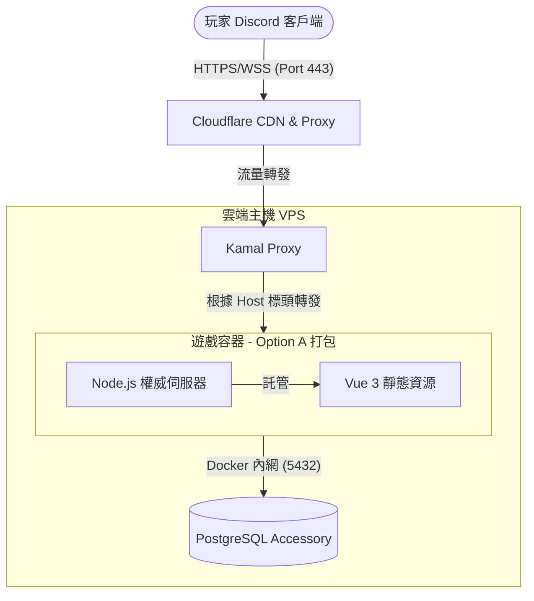

# 🏗 系統架構說明 (System Architecture)

本文件描述 **High Society** 專案的整體設計架構、流量走勢以及核心技術決策。

---

## 1. 全景架構圖 (System Overview)

本專案採用 **「單一入口伺服器」** 架構，所有靜態資源與 WebSocket 通訊皆透過同一個網域服務。

---

## 2. 核心決策：合體打包 (Option A)

為了簡化部署並解決 Discord Activity 嚴格的跨網域限制，我們選擇將前端與後端打包在同一個 Docker 映像檔中。

### **為何選擇此方案？**

1. **徹底解決 CORS 問題**：前端與後端同源 (Same-Origin)，不需處理複雜的跨域標頭。
2. **單一網域管理**：只需要維護一個網域 (`game.miao-bao.cc`)，簡化 SSL 憑證與 Cloudflare 設定。
3. **Discord 友善**：Discord 的 iframe 對外部資源有嚴格的 CSP 限制，單一入口能大幅減少在 Discord Developer Portal 的設定負擔。

---

## 3. 關鍵組件說明

### **A. 前端：Vue 3 + Discord SDK**

- **角色**：負責渲染遊戲 UI 與接收使用者操作。
- **通訊**：透過相對路徑連接 WebSocket (`io()`) 與 API。
- **安全性**：不儲存敏感邏輯，所有動作皆需經過後端驗證。

### **B. 後端：Node.js 權威伺服器**

- **角色**：唯一的真理來源 (Source of Truth)。負責驗證動作、維護狀態機、並託管前端靜態檔案。
- **靜態檔案託管**：使用 `express.static` 託管由 Vite 編譯產出的 `dist` 資料夾。
- **安全性**：必須校驗 Discord 傳來的 `auth token`，確保使用者身分真實性。

### **C. 資料庫：PostgreSQL**

- **角色**：持久化儲存對局狀態、玩家資料與房間資訊。
- **部署**：作為 Kamal 的 **Accessory** 運行，獨立於應用程式容器但位於同一台 VM，透過 Docker 內網溝通。

### **D. 基礎設施：Kamal 2 & Cloudflare**

- **Cloudflare**：開啟「橘色雲朵」模式，提供自動 CDN 快取（針對圖片、JS/CSS）與 DDoS 防護。
- **Kamal Proxy**：作為主機的入口，負責處理零停機部署時的流量切換 (Zero-downtime rolling restart)。

---

## 4. 資料流向 (Data Flow)

### **遊戲啟動流 (Init Flow)**

1. 玩家在 Discord 開啟 Activity。
2. Discord 向 `game.miao-bao.cc` 要求 `index.html`。
3. Cloudflare 命中快取（或是向 Node.js 請求），回傳靜態資源。
4. 前端初始化 Discord SDK 並取得認證資訊。

### **對局動作流 (Game Action Flow)**

1. 玩家點擊「出價」。
2. 前端透過 WebSocket 發送封包。
3. Node.js 接收封包，啟動 **PostgreSQL 事務 (Transaction)**。
4. 檢查是否為該玩家回合 扣除金額 更新最高出價。
5. Node.js 廣播更新後的狀態給房間內所有玩家。

---

## 5. 安全性考量 (Security)

- **Content Security Policy (CSP)**：後端必須明確宣告 `frame-ancestors https://discord.com`，否則 Discord 會阻擋 iframe 載入。
- **隱藏真實 IP**：透過 Cloudflare Proxy 隱藏伺服器真實 IP。
- **內網隔離**：PostgreSQL 不對外開放 Port，僅允許應用程式容器存取。

---

> **相關決策紀錄 (ADR):**
>
> - [ADR-0001: 選擇合體打包方案](https://www.google.com/search?q=./adr/0001-initial-architecture.md)
> - [ADR-0002: 使用 PostgreSQL 替代 Redis 處理回合狀態](https://www.google.com/search?q=./adr/0002-postgresql-state-machine.md)
