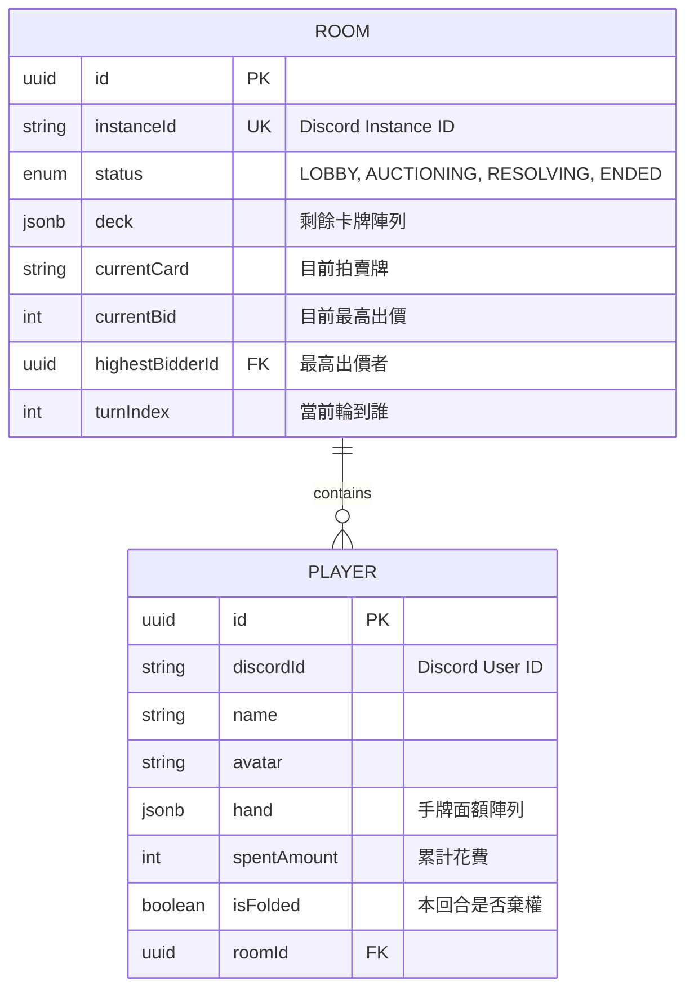

# 🗄 資料庫開發與設計規範 (Database Guide)

本文件說明 **High Society** 專案的資料庫設計哲學、命名規範以及資料遷移（Migration）的工作流程。

---

## 1. 資料庫實體關係圖 (ERD)

我們採用結構化與半結構化（JSONB）並行的設計，平衡資料一致性與開發彈性。



---

## 2. 命名規範 (Naming Conventions)

為了在 TypeScript 與 PostgreSQL 之間取得平衡，我們遵循以下規範：

- **資料表與欄位 (DB Layer)**：一律使用 `snake_case`（底線分隔）。
- **模型名稱 (ORM Layer)**：使用 `PascalCase`（如 `GameRoom`）。
- **應用程式變數 (App Layer)**：Prisma 會自動將欄位映射，我們在程式碼中使用 `camelCase`。
- **列舉 (Enums)**：一律使用 `SCREAMING_SNAKE_CASE`（如 `ROOM_STATUS`）。

---

## 3. 設計哲學：JSONB vs. 正規化

### **為何使用 JSONB 儲存手牌 (hand) 與牌堆 (deck)？**

在《上流社會》中，手牌是一組固定的面額數字，牌堆則是隨機洗過的卡牌序列。

- **優點**：單一 Query 即可取出完整對局狀態，不需頻繁地進行 `JOIN`。
- **場景**：當資料不需要被資料庫引擎進行複雜過濾（如：查詢誰手上有面額 5000 的牌）時，使用 JSONB 儲存陣列能大幅簡化開發。

### **事務 (Transactions) 與鎖**

本專案為回合制遊戲，為防止重複出價或網路延遲導致的競態條件（Race Condition），所有變更狀態的操作**必須**封裝在 `prisma.$transaction` 中。

---

## 4. 資料遷移流程 (The Prisma Cycle)

我們嚴格執行 **「Schema 即程式碼」** 的規範，禁止手動修改生產環境資料庫結構。

1. **修改設計**：在 `packages/backend/prisma/schema.prisma` 進行調整。
2. **建立遷移**：

```bash
pnpm --filter @high-society/backend prisma migrate dev --name <功能描述>

```

這會產生一個包含 SQL 的資料夾，請將其加入 Git 追蹤。3. **衝突處理**：若發現 Migration 衝突，請遵循 [CONTRIBUTING.md](https://www.google.com/search?q=./CONTRIBUTING.md) 中的「Schema 衝突處理 SOP」。4. **部署**：生產環境在容器啟動時會自動執行 `prisma migrate deploy`。

---

## 5. 資料填充 (Seeding)

為了快速測試各種對局情境，我們提供了種子資料腳本：

- **執行腳本**：`pnpm --filter @high-society/backend prisma db seed`
- **包含內容**：
- 一個處於 `LOBBY` 狀態的測試房間。
- 四位具備不同手牌配置的模擬玩家。
- 一個已進入拍賣中期的場景（用於測試結算邏輯）。

---

## 6. 效能優化準則

- **索引 (Indexes)**：
- `instanceId` 必須建立唯一索引，因為它是 Discord 認證的關鍵。
- `roomId` 與 `discordId` 的組合應考慮建立複合索引以加速玩家查詢。

- **嚴禁 Select \***：在 Prisma 中請善用 `select` 或 `include`，避免抓取不必要的 JSONB 大欄位。

---

> 「資料庫是專案中唯一有『記憶』的地方。請溫柔地對待它，在動手改欄位之前，先想清楚這筆資料在三個月後是否依然有意義。」
